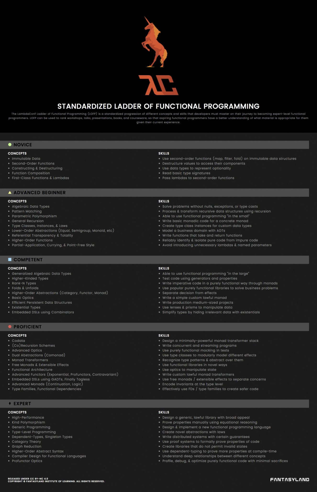

The other day I came across an interesting graphic that describes the different skill levels of a functional programmer:



According to the graphic, the "Ladder of Functional Programming" is a standardized progression of different concepts and skills that a
developer must master to become an expert in functional programming. Whether or not this is true is debatable at best;
many people criticized this graphic as being non-realistic. However, the ladder does pick interesting topics and puts them in a relatively increasing order of complexity, so I thought it would be fun to do a series on reviewing the concepts and skills for each level. I don't want to do a deep dive because topics are easily found
with a quick google search, but I'll review the material with a bit of personal input.

This is part 1 of the series, so I will be covering the "Novice" portion of the graphic.
<br>
<br>

## Immutable Data
In general, immutable data is data that cannot be changed. Once the value of an object is set, the value of the object cannot be modified.

For example, variables in Python are mutable, so once you assign a value to a variable, you can keep reassigning it:
```
x = 42
x = 43
```

However, in Haskell, variables are immutable. If you attempt to modify the variable after assignment, it will fail:
```
x = 42
x = 43
```

```
$ stack ghc immutable.hs
[1 of 1] Compiling Main             ( immutable.hs, immutable.o )

immutable.hs:2:1: error:
    Multiple declarations of ‘x’
    Declared at: immutable.hs:1:1
                 immutable.hs:2:1
  |
2 | x = 43
  | ^
```

There are a few benefits of making data immutable:
- Code becomes easier to read because variables don't change values.
- Variables are inherently thread-safe since they cannot be modified by various threads.

A negative aspect of immutability is that it's more memory-inefficient. If a data object does need to be modified, a new object has to be created in memory as opposed to having the same object being modified.

In languages like Rust and OCaml, variables are immutable by default and must me explicitly marked to be made mutable. This allows those languages to take advantage of both immutable and mutable data types.

For a more concrete example, a program may need to manipulate a large array of data. It is not ideal to make a new copy of the array every time it is modified. Therefore, marking the array as mutable can take advantage of improved speed and memory efficiency, while other data in the program utilize the advantages of immutability.
<br>
<br>

## Second-Order Functions
A second-order function is a function that takes another function as input or returns a function as its result. In general, a second-order function is categorized as a higher-order function. A function that is not a higher-order function is a first-order function and does not take a function as input or return a function.

 A common pattern in software are list transformations, where a function is applied to each element in a list construct. For example, this is a list transformation in an imperative language such as Python:
```
list = ['element1', 'element2', 'element3']
new_list = []

for element in list:
    new_element = operation(element)
    new_list.append(new_element)
```
However in a functional language like Haskell, a higher-order function such as `map`, which has parameters `function` and `list`, can be used to apply a function to each element in the list:
```
list = ['element1', 'element2', 'element3'] 
new_list = map operation list
```

Where `map` literally maps (from a mathematical perspective) one list to another via the operation. This allows a programmer to think in terms of list transformations and also reduce the multiline for-loop structure into a one line expression. This arguably reduces complexity during development, leading to improved comprehensibility of the code.
<br>
<br>

## Contructing and Destructuring
Constructing is a technique for building objects while destructuring is technique for extracting data from those objects.

For example, to build an object in Haskell:
```
> data Person = Person { firstName :: String, lastName :: String, age :: Int}
> :t Person
Person :: String -> String -> Int -> Person
```
This example used "record syntax", where the data type `Person` was created with the fields `firstName`, `lastName`, and `age`. This autogenerates functions `firstName`, `lastName,` and `age`, which can be used to access data from a `Person` type.

To create an instance of the object
```
> James = Person "James" "Kurt" 25
> :t James
Person :: String -> Int -> String -> Person
```
To access the fields of the object:
```
> firstName James
"James"
> lastName James
"Kurt"
> age James
25

> :t firstName
firstName :: Person -> String
> :t age
age :: Person -> Int
```

The same concepts apply to lists and tuples. There are ways to construct and destructure these types:
```
list1 = 1 : 2 : 3 : []
list2 = [1..10]

> head list1
1
> tail list1
[2, 3]

----

t = (1, 2)

> fst t
1
> snd t
2
```

This is just the tip of the iceberg; there are many other ways to create objects and how to access their members.
<br>
<br>

## Function Composition
A function composition is a function composed of two or more functions. In math, this is represented as `f(x)` and `g(x)`, and the composition is `f(g(x))` or `f . g (x)`. From an information flow point of view, the data `x` is inputted to function `g` and the output is inputted to function `f`. This allows various chaining of operations.

For example:
```
inc x = x + 1
make_negative x = -x

op1 = make_negative . inc
> op1 0
-1

op2 = make_negative . inc . inc 
> op2 0
-2
```

The ability to chain functions together leads to easy development of pipeline design patterns. Furthermore, it promotes modularity and code-reusability because functions are easily interchangeable.
<br>
<br>

## First-Class Functions & Lambdas
A language supports first-class functions if it allows functions to be passed as arguments to other functions, returned as values from other functions, and assigning functions to variables. This is closely related to higher-order functions and function composition, because a language must support first-class functions if it intends to support either of these concepts.

A lambda function is also known as an anonymous function because they don't require a name. In Haskell, for example:
```
\x -> x + 1
```

This is allows closures and currying to be developed, which will be discussed in later blog potts. A named function can be used anywhere a lambda function is used, however, sometimes it's convenient to use a lambda function, especially when the function is small.
